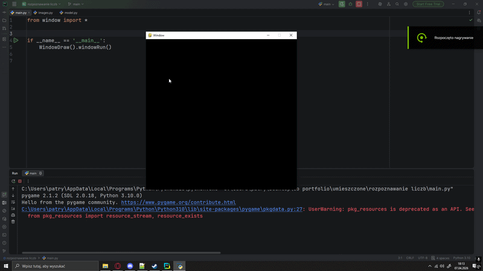

# DIGIT RECOGNITION AI 

# PROJECT DESCRIPTION 
This project is my implementation of the classic Handwritten Digit Recognition task using the MNIST dataset. 
To go beyond a simple script, I developed an interactive drawing application that allows users to test the model in real-time.
Instead of just testing on pre-existing data, you can draw your own numbers on a digital canvas, and the neural network will attempt to recognize them instantly.

# CORE TECHNOLOGIES 
- **Python**: Main programming language.
- **PyTorch**: Used for building the CNN architecture, handling the MNIST dataset, and performing inference.
- **Pygame**: Used to create the drawing canvas and handle user input.
- **PIL (Pillow)**: Used for image processing, resizing the user's drawing to 28x28 pixels to match the model's input requirements.

# HOW IT WORKS 
1. **Architecture (CNN)**: Unlike the Snake project, this model uses a Convolutional Layer (`nn.Conv2d`), which is specifically designed to recognize spatial patterns in images.
  - **Layer 1**: Convolutional layer + ReLU activation + MaxPool (reduces image size while keeping important features).
  - **Layer 2**: Fully connected layer (Hidden size: 128).
  - **Output**: 10 nodes (representing digits 0–9).
2. **Processing**: When the user draws a digit and presses the trigger key, the application takes a screenshot, converts it to grayscale, and downscales it to a 28x28 pixel matrix.
3. **Prediction**: The processed image is fed into the network, which returns the index of the highest value in the output vector (using `argmax()`).

# PROJECT STRUCTURE 
- `main.py`: Entry point of the application.
- `model.py`: Contains the `NeuralNet` class (CNN architecture) and the `Trainer` class for loading data and making predictions.
- `window.py`: Handles the Pygame window, drawing logic (white brush on black background), and key events.
- `images.py`: Responsible for converting the raw drawing into a format the AI understands (pixel normalization).

# REQUIREMENTS 
- torch
- torchvision
- pygame
- pillow
- python 3.10+

# HOW TO USE 
The project comes with a pre-trained model (`model/model.pth`) so you don't need to train it yourself to see the results.
You just need to run the main script (`main.py`).
Once the window appears, you can interact with the AI using your mouse and keyboard:
  - **Draw**: Use your Left Mouse Button to draw any digit (0-9) on the black canvas.
  - **Recognize ('T')**: Press the `T` key. The AI will take a screenshot, process it to 28x28 pixels, and print its prediction in the terminal.
  - **Clear ('Q')**: Press the `Q` key to wipe the canvas and draw a new number.

# WHAT IT LOOKS LIKE

# KNOWN ISSUES & LIMITATIONS 
- **Image Downscaling & Stroke Thickness**
  The main challenge in this project is the transition from the 600x600 drawing canvas to the 28x28 pixel input required by the CNN. 
  Even when utilizing advanced PIL techniques like `Image.Resampling.LANCZOS`, there is a noticeable loss of detail and, most importantly, stroke thickness.
  A digit that appears to be drawn with bold, thick lines on the 600x600 screen becomes significantly thinner after downscaling. 
  Since the model was trained on the MNIST dataset, which consists of digits with specific stroke weights, these unexpectedly thin lines can cause the neural network to misclassify the drawing.

- **Handwriting Variability**
  Additionally, the model can struggle with the natural variability in human handwriting, especially when the user's drawing style differs significantly from the standardized, perfectly centered digits found in the training data.
